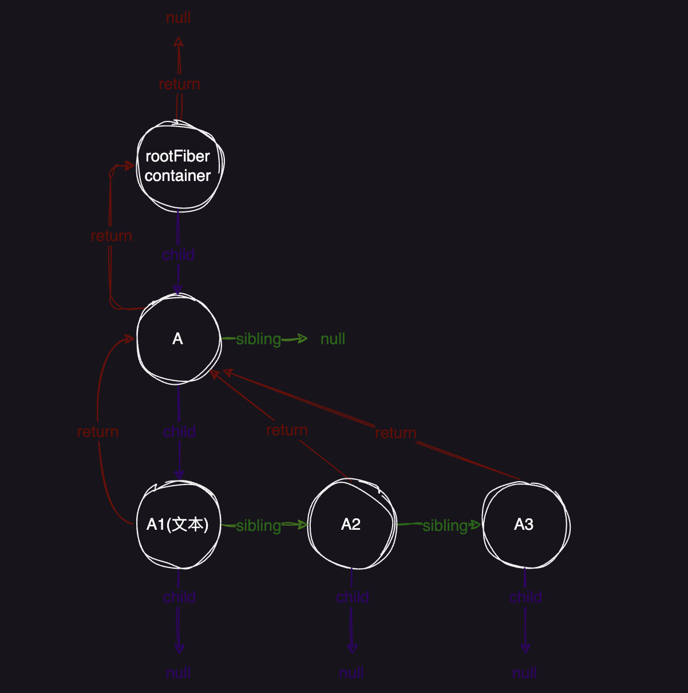
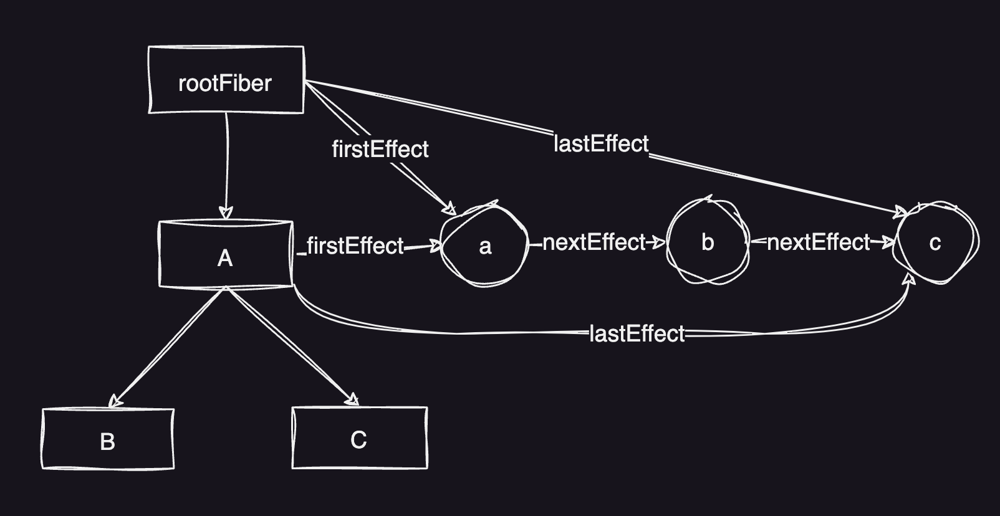
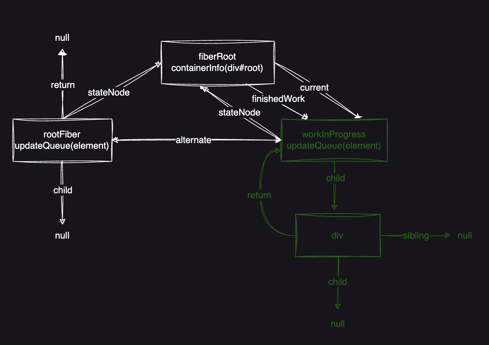
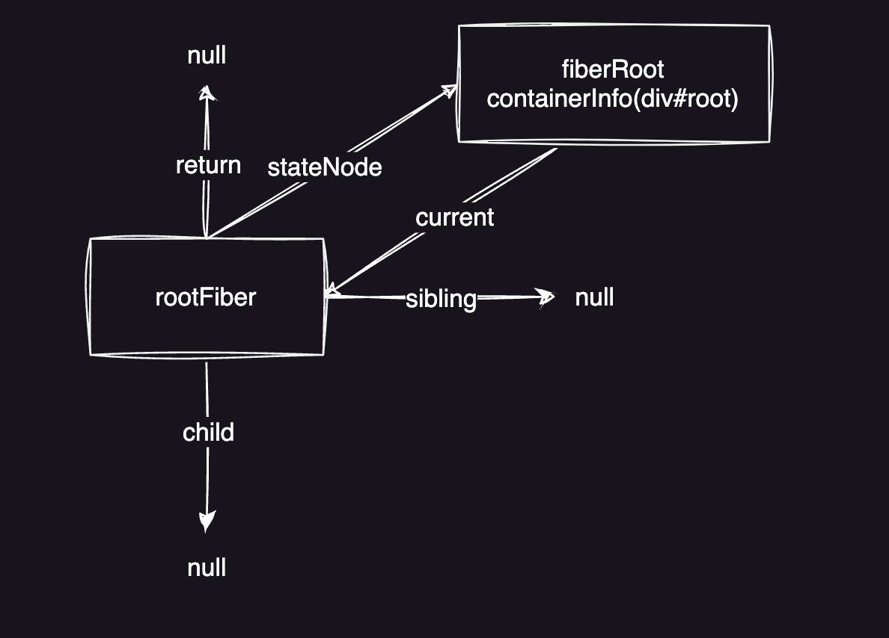
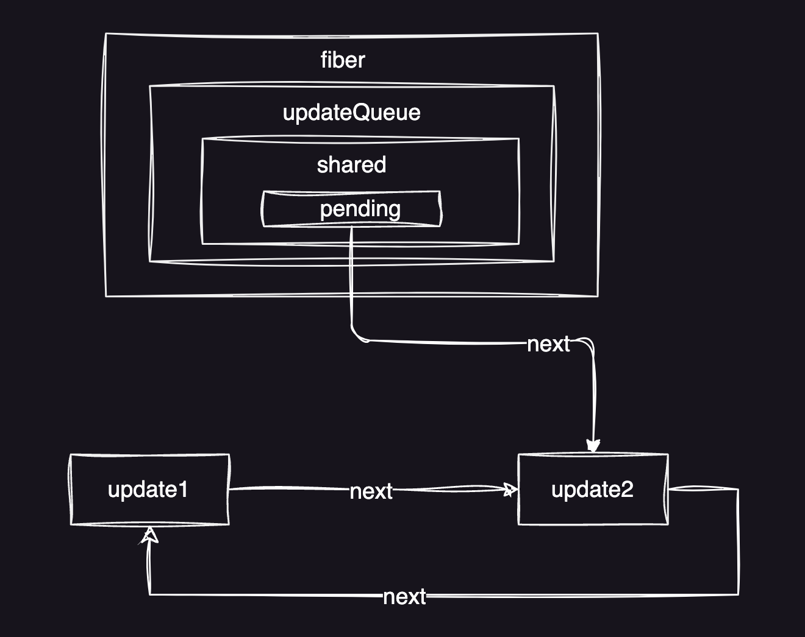

# React Fiber

## React架构
- Scheduler (调度层): 调度任务的优先级，高优任务优先进入协调器
- Reconciler(协调层): 构建 Fiber 数据结构，比对 Fiber 对象找出差异,记录 Fiber 对象要进行的 DOM 操作
- Renderer (渲染层): 负责将发生变化的部分渲染到页面上

## 问题
在 React v15 及之前版本使用的协调算法(Stack Reconciler)，由于 Stack Reconciler 天生带来的局限性，使得 DOM 更新过程是同步的。也就是说，在虚拟 DOM 的比对过程中，如果发现一个元素实例有更新，则会立即同步执行操作，提交到真实 DOM 的更改。而在虚拟 DOM 的比对过程中，又采用了循环加递归的方式进行比对，由于递归使用JavaScript 自身的执行栈，一旦开始就无法停止，直到任务执行完成。如果虚拟 DOM 树的层级比较深，比对就会长期占用JavaScript 主线程，由于JavaScript 又是单线程的无法同时执行其他任务，所以在比对的过程中无法响应用户操作，无法即时执行元素动画，造成了页面卡顿的现象。

## 解决
为了解决以上的痛点问题，React v16 之后引入了 Fiber，将原本同步不可中断的更新，变成异步可中断的更新，将原本一个耗时的大任务拆分成一个个小任务，通过合理的调度机制来调控时间，指定任务执行的时机，从而降低页面卡顿的概率，提升页面交互体验。通过Fiber架构，让 Reconciler 过程变得可被中断，利用浏览器的空闲时间完成的，不会长期占用主线程，适时地让出CPU执行权，可以让浏览器及时地响应用户的交互。

## requestIdleCallback
我们知道，在浏览器中，页面是一帧一帧绘制出来的，渲染的帧率与设备的刷新率保持一致。一般情况下，设备的屏幕刷新率为60次/1s，当每秒内绘制的帧数超过60时，页面渲染是流畅的，而当每秒内绘制的帧数小于60时，会出现一定程度的卡顿现象。
在两个执行帧之间，主线程通常会有一小段空闲时间，在这个空闲时间可以触发 requestIdleCallback 方法，而 React 就是利用浏览器提供的requestIdleCallback API，将任务插入到浏览器的空闲时间段中执行，浏览器执行完这个方法后，如果没有剩余时间了，或者已经没有下一个可执行的任务了，React应该归还控制权，并同样使用requestIdleCallback去申请下一个时间片，从而避免长时间阻塞主线程，保证页面的流畅性。

但使用 requestIdleCallback 它自身也存在一些问题，比如说并不是所有的浏览器都支持它，而且它的触发频率也不是很稳定，所以 React最终放弃了 requestldleCallback 的使用。在 React 中，官方实现了自己的任务调度库，这个库就叫做 Scheduler。它也可以实现在浏览器空闲时执行任务，而且还可以设置任务的优先级，高优先级任务先执行，低优先级任务后执行。

## Fiber
### 什么是Fiber
- 一个执行单元
Fiber 可以理解为一个执行单元，它是把一个大任务拆分为了很多个小块任务，一个小块任务的执行必须是一次完成的，不能出现暂停，每次执行完一个执行单元，react 就会检查现在还剩多少时间，如果没有时间则将控制权让出去。
- 一种数据结构
Fiber 还可以理解为是一种数据结构，每个 Virtual DOM 都可以表示为一个 fiber，一个 fiber包括了 child（第一个子节点）、sibling（兄弟节点）、return（父节点）等属性。

### Fiber结构
```js
Fiber = {
    // 标识 fiber 类型的标签 (HostRoot = 3 fiber的根节点; HostComponent = 5 原生组件)
    tag: WorkTag,
    // 指向父节点
    return: Fiber | null,
    // 指向子节点
    child: Fiber | null,
    // 指向兄弟节点
    sibling: Fiber | null,
    // 实例对象
    stateNode: any,
    // current 树中的 fiber 通过 alternate 指向 workInProgress 树中对应的 fiber
    // workInProgress 树中的 fiber 通过 alternate 指向 current 树中对应的 fiber
    alternate: Fiber | null,
    // 新的 props 值
    pendingProps: any,
    // 上一次渲染使用的 props 值
    memoizedProps: any,
    // 上一次渲染使用的 state 值
    memoizedState: any,
    // 该 fiber 对应的组件产生的状态更新
    updateQueue: UpdateQueue<any> | null
    // 用来记录当前fiber要执行的 DOM 操作
    effectTag: SideEffectTag,
    // effect 节点指针，指向下一个 effect
    nextEffect: Fiber | null,
    // effect list 是单向链表，第一个 effect
    firstEffect: Fiber | null,
    // effect list 是单向链表，最后一个 effect
    lastEffect: Fiber | null,
    // work 的过期时间，可用于标识一个 work 优先级顺序
    expirationTime: ExpirationTime,
};
```
### Fiber的特点
- 可以暂停，并在之后可以重新次开始
- 可以为不同类型的fiber设置优先级
- 复用之前已经完成的fiber
- 终止已经不再需要的工作

### Fiber树

react在首次渲染时会生成一棵Fiber树，在Diff更新的时候也会根据已有Fiber树和最新虚拟 DOM的信息，生成一棵新的Fiber树，这颗新树每生成一个新的节点，都会将控制权交回给主线程，去检查有没有优先级更高的任务需要执行，如果没有，则继续构建树的过程，如果过程中有优先级更高的任务需要进行，则会暂停生成节点，在空闲的时候再继续执行。

在构造Fiber树的过程中，React 会将需要更新的节点信息保存在Effect List当中，在 commit 阶段，会批量更新相应的节点。

## Effects list
React 采用深度优先搜索算法，在 render 阶段遍历 fiber 树时，把每一个有副作用的 fiber 筛选出来，通过每个节点更新结束时向上归并 effect list 来收集任务结果，最后根节点的effect list里就记录了包括了所有需要变更的结果。


在 commit 阶段，React 拿到 effect list 数据后，通过遍历 effect list，并根据每一个 effect 节点的 effectTag 类型，从而对相应的 DOM 树执行更改（注意：此阶段不能暂停，否则会出现UI更新不连续的现象）。

## 双缓存技术
在 React 中最多会同时存在两棵Fiber 树，当前在屏幕中显示的内容对应的 Fiber 树叫做 current Fiber 树，当发生更新时，React 会在内存中重新构建一颗新的 Fiber 树，这颗新构建的 Fiber 树叫做 workinProgress Fiber 树。在双缓存技术中，后续所有发生 work 的地方都是在 workInProgress 树中执行，在 commit 阶段 React 会使用它直接替换 current Fiber 树达到快速更新 DOM 的目的，因为 workInProgress Fiber 树是在内存中构建的所以构建它的速度是非常快的。
一旦 workInProgress Fiber 树在屏幕上呈现，它就会变成 current Fiber 树。
在current Fiber 节点对象中有一个alternate 属性指向对应的workinProgress Fiber 节点对象,在workinProgress Fiber 节点中有一个alternate 属性也指向对应的 current Fiber 节点对象。

React 使用双缓存技术完成 Fiber 树的构建与替换，实现了DOM对象的快速更新


##  区分 fiberRoot 与 rootFiber
- fiberRoot 表示 Fiber 数据结构对象，是 Fiber 数据结构中的最外层对象
- rootFiber 表示组件挂载点对应的 Fiber 对象，比如 React 应用中默认的组件挂载点就是id为 root 的 div
- fiberRoot 包含 rootFiber，在 fiberRoot 对象中有一个 current 属性，存储rootFiber
- rootFiber 指向 fiberRoot，在 rootFiber 对象中有一个 stateNode 属性，指向 fiberRoot
- 在 React 应用中 FiberRoot 只有一个，而rootFiber 可以有多个，因为render 方法是可以调用多次的
- fiberRoot 会记录应用的更新信息，比如协调器在完成工作后，会将工作成果存储在 fiberRoot 中。

## 源码简析
### render
```js
/**
 * 渲染入口
 * element 要进行渲染的 ReactElement，createElement 方法的返回值
 * container 渲染容器 <div id="root"></div>
 * callback 渲染完成后执行的回调函数
*/
export function render(
  element: React$Element<any>,
  container: Container,
  callback: ?Function,
) {
  // 检测 container 是否是符合要求的渲染容器
  // 即检测 container 是否是真实的DOM对象
  invariant(
    isValidContainer(container),
    'Target container is not a DOM element.',
  );
  ...
  return legacyRenderSubtreeIntoContainer(
    null,
    element,
    container,
    false,
    callback,
  );
}
```
### legacyRenderSubtreeIntoContainer
```js
/**
 * 将子树渲染到容器中 (初始化 Fiber 数据结构: 创建 fiberRoot 及 rootFiber
 * parentComponent: 父组件，初始渲染传入了 null
 * children: render 方法中的第一个参数，要渲染的 ReactElement
 * container: 渲染容器
 * forceHydrate: true 为服务端渲染，false 为客户端渲染
 * callback: 组件渲染完成后需要执行的回调函数
*/
function legacyRenderSubtreeIntoContainer(
  parentComponent: ?React$Component<any, any>,
  children: ReactNodeList,
  container: Container,
  forceHydrate: boolean,
  callback: ?Function,
) {
  ...
  /**
   * 检测 container 是否已经是初始化过的渲染容器
   * react 在初始渲染时会为最外层容器添加_reactRootContainer 属性
   * react 会根据此属性进行不同的渲染方式
   * root 不存在 表示初始渲染
   * root 存在 表示更新
  */
  // 获取 container 容器对象下是否有 _reactRootContainer 属性
  let root: RootType = (container._reactRootContainer: any);
  let fiberRoot;
  if (!root) {
    // 初始渲染
    // 初始化根 Fiber 数据结构
    // 为 container 容器添加 _reactRootContainer 属性
    // 在 _reactRootContainer 对象中有一个属性叫做 _internalRoot
    // _internalRoot 属性值即为 FiberRoot 表示根节点 Fiber 数据结构
    // 简单来说就是创建 fiberRoot 和 rootFiber
    root = container._reactRootContainer = legacyCreateRootFromDOMContainer(
      container,
      forceHydrate,
    );
    fiberRoot = root._internalRoot;
    // 改变 callback 函数中的 this 指向，使其指向 render 方法第一个参数的真实 DOM 对象
    if (typeof callback === 'function') {
      const originalCallback = callback;
      callback = function() {
        const instance = getPublicRootInstance(fiberRoot);
        originalCallback.call(instance);
      };
    }
    // 初始化渲染不执行批量更新
    // 因为批量更新是异步的是可以被打断的，但是初始化渲染应该尽快完成不能被打断
    // 所以不执行批量更新
    unbatchedUpdates(() => {
      updateContainer(children, fiberRoot, parentComponent, callback);
    });
  } else {
    fiberRoot = root._internalRoot;
    if (typeof callback === 'function') {
      const originalCallback = callback;
      callback = function() {
        const instance = getPublicRootInstance(fiberRoot);
        originalCallback.call(instance);
      };
    }
    // Update
    updateContainer(children, fiberRoot, parentComponent, callback);
  }
  // 返回 render 方法第一个参数的真实 DOM 对象作为 render 方法的返回值
  // 就是说渲染谁 返回谁的真实 DOM 对象
  return getPublicRootInstance(fiberRoot);
}
```
### legacyCreateRootFromDOMContainer
```js
/**
 * 判断是否为服务器端渲染，如果不是服务器端渲染，清空 container 容器中的节点
*/
function legacyCreateRootFromDOMContainer(
  container: Container,
  forceHydrate: boolean, // 服务器端渲染
): RootType {
  // 是否为服务器端渲染
  const shouldHydrate =
    forceHydrate || shouldHydrateDueToLegacyHeuristic(container);
  if (!shouldHydrate) {
    let warned = false;
    let rootSibling;
    // 开启循环，删除 container 容器中的节点
    while ((rootSibling = container.lastChild)) {
      ...
      container.removeChild(rootSibling);
      /**
       * 为什么要清除container 中的元素?
       * 有时需要在 container 中放置一些占位图或者 loading 图以提高首屏加载用户体验
       * 就无可避免的要向 container 中加入 html 标记
       * 在将 ReactElement 渲染到 container 之前，必然要先清空 container 
       * 因为占位图和 ReactElement 不能同时显示
       * 在加入占位代码时，最好只有一个父级元可以减少内部代码的循环次数以提高性能
      */
    }
  }
  ...
  return createLegacyRoot(
    container,
    shouldHydrate
      ? {
          hydrate: true,
        }
      : undefined,
  );
}
```
### createLegacyRoot
```js
/**
 * 通过实例化 ReactDOMBlockingRoot 类创建 LegacyRoot
*/
export function createLegacyRoot(
  container: Container,
  options?: RootOptions,
): RootType {
  // LegacyRoot 常量，为 0
  // 通过 render 方法创建的 container 就是 LegacyRoot
  return new ReactDOMBlockingRoot(container, LegacyRoot, options);
}
```
### createFiberRoot
```js
// 创建根节点对应的 fiber 对象
export function createFiberRoot(
  containerInfo: any,
  tag: RootTag,
  hydrate: boolean,
  hydrationCallbacks: null | SuspenseHydrationCallbacks,
): FiberRoot {
  // 创建 FiberRoot
  const root: FiberRoot = (new FiberRootNode(containerInfo, tag, hydrate): any);
  if (enableSuspenseCallback) {
    root.hydrationCallbacks = hydrationCallbacks;
  }

  // 创建根节点对应的 rootFiber
  const uninitializedFiber = createHostRootFiber(tag);
  root.current = uninitializedFiber;
  uninitializedFiber.stateNode = root;
  // 为 fiber 对象添加 updateQueue 属性，初始化 updateQueue 对象
  // updateQueue 用于存放 Update 对象
  // Update 对象用于记录组件状态的改变
  initializeUpdateQueue(uninitializedFiber);

  return root;
}
```


### updateContainer
```js
/**
 * 计算任务的过期时间
 * 再根据任务过期时间创建 Update 任务
 * 通过任务的过期时间还可以计算出任务的优先级
*/
export function updateContainer(
  element: ReactNodeList,
  container: OpaqueRoot,
  // parentComponent 父组件，初始为 null
  parentComponent: ?React$Component<any, any>,
  callback: ?Function,
): Lane {
  ...
  const current = container.current;
  const eventTime = requestEventTime();
  ...
  const lane = requestUpdateLane(current);

  if (enableSchedulingProfiler) {
    markRenderScheduled(lane);
  }

  // 设置FiberRoot.context，首次执行返回一个emptyContext，是一个 {}
  const context = getContextForSubtree(parentComponent);
  // 初始渲染时 Fiber Root 对象中的 context 属性值为 null
  if (container.context === null) {
    container.context = context;
  } else {
    container.pendingContext = context;
  }

  ...

  // 创建一个更新任务
  const update = createUpdate(eventTime, lane);
  // 将要更新的内容挂载到更新对象中的 payload 中
  // 将要更新的组件存储在 payload 对象中，方便后期获取
  update.payload = {element};

  callback = callback === undefined ? null : callback;
  if (callback !== null) {
    ...
    // 将 callback 挂载到 update 对象中
    // 其实就是一层层传递 方便 ReactElement 元素渲染完成调用
    // 回调函数执行完成后会被清除 可以在代码的后面加上 return 进行验证
    update.callback = callback;
  }
  // 将 update 对象加入到当前 Fiber 的更新队列当中 (updateQueue)
  // 待执行的任务都会被存储在 fiber.updateQueue.shared.pending 中
  enqueueUpdate(current, update);
  // 调度和更新 current 对象
  scheduleUpdateOnFiber(current, lane, eventTime);

  return lane;
}
```
### enqueueUpdate
```js
// 将任务(Update)存放于任务队列(updateQueue)中
// 创建单向链表结构存放 update，next 用来串联 update
export function enqueueUpdate<State>(fiber: Fiber, update: Update<State>) {
  const updateQueue = fiber.updateQueue;
  // 如果更新队列不存在，就返回 null
  if (updateQueue === null) {
    // 仅发生在 fiber 被卸载 .
    return;
  }

  const sharedQueue: SharedQueue<State> = (updateQueue: any).shared;
  const pending = sharedQueue.pending;
  if (pending === null) {
    // This is the first update. Create a circular list.
    update.next = update;
  } else {
    update.next = pending.next;
    pending.next = update;
  }
  sharedQueue.pending = update;

  ...
}
```


### scheduleUpdateOnFiber
```js
// 核心：判断任务是否为同步任务，调用同步任务入口
export function scheduleUpdateOnFiber(
  fiber: Fiber,
  lane: Lane,
  eventTime: number,
) {
  // 判断是否是无限循环的 update,如果是就报错
  checkForNestedUpdates();
  ...
  // 获取当前调度任务的优先级
  const priorityLevel = getCurrentPriorityLevel();

  if (lane === SyncLane) {
    if (
      // 判断是否处于非批量更新模式
      (executionContext & LegacyUnbatchedContext) !== NoContext &&
      // 检查是否没有处于正在进行渲染的任务
      (executionContext & (RenderContext | CommitContext)) === NoContext
    ) {
      // 在根上注册待处理的交互，以避免丢失跟踪的交互数据
      // 初始渲染时内部条件判断不成立，内部代码没有得到执行
      schedulePendingInteractions(root, lane);

      // 同步任务入口
      performSyncWorkOnRoot(root);
    } else {
      ...
    }
  } else {
    ...
  }
  mostRecentlyUpdatedRoot = root;
}
```
### performSyncWorkOnRoot
```js
// 正式进入 render 阶段，构建workInProgress Fiber 树
function performSyncWorkOnRoot(root) {
  // 参数root为 fiberRoot 对象
  
  // 处理useEffect
  flushPassiveEffects();

  let lanes;
  let exitStatus;
  // 说明 workInProgressRoot 不存在，说明还没有构建 workInProgress Fiber树
  // workInProaressRoot 为全局变量 默认值为null，初始渲染时值为 null
  if (
    root === workInProgressRoot &&
    includesSomeLane(root.expiredLanes, workInProgressRootRenderLanes)
  ) {
    ...
  } else {
    lanes = getNextLanes(root, NoLanes);
    exitStatus = renderRootSync(root, lanes);
  }

  if (root.tag !== LegacyRoot && exitStatus === RootErrored) {
    executionContext |= RetryAfterError;

    // If an error occurred during hydration,
    // discard server response and fall back to client side render.
    if (root.hydrate) {
      root.hydrate = false;
      clearContainer(root.containerInfo);
    }

    // If something threw an error, try rendering one more time. We'll render
    // synchronously to block concurrent data mutations, and we'll includes
    // all pending updates are included. If it still fails after the second
    // attempt, we'll give up and commit the resulting tree.
    lanes = getLanesToRetrySynchronouslyOnError(root);
    if (lanes !== NoLanes) {
      exitStatus = renderRootSync(root, lanes);
    }
  }

  if (exitStatus === RootFatalErrored) {
    const fatalError = workInProgressRootFatalError;
    prepareFreshStack(root, NoLanes);
    markRootSuspended(root, lanes);
    ensureRootIsScheduled(root, now());
    throw fatalError;
  }

  // 为 FiberRoot 对象添加 finishedWork 属性
  // finishedWork 表示 render 阶段执行完成后构建的待提交的 Fiber 对象
  const finishedWork: Fiber = (root.current.alternate: any);
  root.finishedWork = finishedWork;
  root.finishedLanes = lanes;
  commitRoot(root);

  // Before exiting, make sure there's a callback scheduled for the next
  // pending level.
  ensureRootIsScheduled(root, now());

  return null;
}
```
### prepareFreshStack

```js
function prepareFreshStack(root: FiberRoot, lanes: Lanes) {
  // 为 FiberRoot 对象添加 finishedWork 属性
  // finishedWork 表示 render 阶段执行完成后构建的待提交的 Fiber 对象
  root.finishedWork = null;
  // 初始化 finishedLanes 值为 0
  root.finishedLanes = NoLanes;

  ... 
  // 构建 workInProgress fiber 树的 fiberRoot对象
  workInProgressRoot = root;
  // 构建 workInProgress fiber 树的 rootFiber
  // workInProgress 是一个全局变量
  workInProgress = createWorkInProgress(root.current, null);
  workInProgressRootRenderLanes = subtreeRenderLanes = workInProgressRootIncludedLanes = lanes;
  workInProgressRootExitStatus = RootIncomplete;
  workInProgressRootFatalError = null;
  workInProgressRootSkippedLanes = NoLanes;
  workInProgressRootUpdatedLanes = NoLanes;
  workInProgressRootPingedLanes = NoLanes;

  if (enableSchedulerTracing) {
    spawnedWorkDuringRender = null;
  }
  ...
}
```

### createWorkInProgress
```js
// 构建 workInProgress Fiber 树中的 rootFiber
// 构建完成后会替换 current fiber
// 初始渲染 pendingProps 为 null
export function createWorkInProgress(current: Fiber, pendingProps: any): Fiber {
  let workInProgress = current.alternate;
  if (workInProgress === null) {
    // 创建 fiber 对象
    workInProgress = createFiber(
      current.tag,
      pendingProps,
      current.key,
      current.mode,
    );
    // 属性复用
    workInProgress.elementType = current.elementType;
    workInProgress.type = current.type;
    workInProgress.stateNode = current.stateNode;

    ...

    // 使用 alternate存储 current
    workInProgress.alternate = current;
    // 使用alternate 存储 workInProgress
    current.alternate = workInProgress;
  } else {
    ...
  }

  workInProgress.childLanes = current.childLanes;
  workInProgress.lanes = current.lanes;

  workInProgress.child = current.child;
  workInProgress.memoizedProps = current.memoizedProps;
  workInProgress.memoizedState = current.memoizedState;
  workInProgress.updateQueue = current.updateQueue;

  // Clone the dependencies object. This is mutated during the render phase, so
  // it cannot be shared with the current fiber.
  const currentDependencies = current.dependencies;
  workInProgress.dependencies =
    currentDependencies === null
      ? null
      : {
          lanes: currentDependencies.lanes,
          firstContext: currentDependencies.firstContext,
        };

  // These will be overridden during the parent's reconciliation
  workInProgress.sibling = current.sibling;
  workInProgress.index = current.index;
  workInProgress.ref = current.ref;

  if (enableProfilerTimer) {
    workInProgress.selfBaseDuration = current.selfBaseDuration;
    workInProgress.treeBaseDuration = current.treeBaseDuration;
  }

  ...

  return workInProgress;
}
```
### workLoopSync
```js
// 构建除 rootFiber 以外的所有子集 fiber 对象
// workInProgress 是一个 fiber 对象
// 它的值不为 null 意味着该 fiber 对象上仍然有更新要执行
// while 方法支撑 render 阶段 所有 fiber 节点的构建
function workLoopSync() {
  while (workInProgress !== null) {
    performUnitOfWork(workInProgress);
  }
}
```

### performUnitOfWork
```js
function performUnitOfWork(unitOfWork: Fiber): void {
  const current = unitOfWork.alternate;
  setCurrentDebugFiberInDEV(unitOfWork);

  // 存储下一个要构建的子集 fiber 对象
  let next;
  if (enableProfilerTimer && (unitOfWork.mode & ProfileMode) !== NoMode) {
    startProfilerTimer(unitOfWork);
    next = beginWork(current, unitOfWork, subtreeRenderLanes);
    stopProfilerTimerIfRunningAndRecordDelta(unitOfWork, true);
  } else {
    // beginWork: 从父到子，构建 Fiber 节点对象
    // 返回值 next 为当前节点的子节点
    next = beginWork(current, unitOfWork, subtreeRenderLanes);
  }

  resetCurrentDebugFiberInDEV();
  unitOfWork.memoizedProps = unitOfWork.pendingProps;
  // 如果子节点不存在说明当前节点向下遍历子节点已经到底了
  // 继续向上返回 遇到兄弟节点 构建兄弟节点的子 Fiber 对象 直到返回到根 Fiber
  if (next === null) {
    // If this doesn't spawn new work, complete the current work.
    completeUnitOfWork(unitOfWork);
  } else {
    workInProgress = next;
  }

  ReactCurrentOwner.current = null;
}
```

### beginWork
```js
function beginWork(
  current: Fiber | null,
  workInProgress: Fiber,
  renderLanes: Lanes,
): Fiber | null {
  const updateLanes = workInProgress.lanes;

  ...
 
  workInProgress.lanes = NoLanes;

  switch (workInProgress.tag) {
    ...
    case HostRoot:
      return updateHostRoot(current, workInProgress, renderLanes);
    ...
  }
}
```

### updateHostRoot

```js
function updateHostRoot(current, workInProgress, renderLanes) {
  pushHostRootContext(workInProgress);
  const updateQueue = workInProgress.updateQueue;
  ...
  const nextProps = workInProgress.pendingProps;
  const prevState = workInProgress.memoizedState;
  const prevChildren = prevState !== null ? prevState.element : null;
  // 浅复制更新队列，防止引用属性互相影响
  // workInProgress.updateQueue 浅拷贝 current.updateQueue
  cloneUpdateQueue(current, workInProgress);
  // 获取 updateQueue.payload 并赋值到 workInProgress.memoizedState
  // 要更新的内容就是 element 就是 rootFiber 的子元素
  processUpdateQueue(workInProgress, nextProps, null, renderLanes);
  const nextState = workInProgress.memoizedState;
  const nextChildren = nextState.element;
  ...
  const root: FiberRoot = workInProgress.stateNode;
  if (root.hydrate && enterHydrationState(workInProgress)) {
    ...
  } else {
    // 构建子节点 fiber 对象
    reconcileChildren(current, workInProgress, nextChildren, renderLanes);
    resetHydrationState();
  }
  return workInProgress.child;
}
```
### reconcileChildren
```js
// 构建子集 fiber 对象
export function reconcileChildren(
  current: Fiber | null, // 旧 fiber
  workInProgress: Fiber, // 父级 fiber
  nextChildren: any,  // 子级 VDom 对象
  renderLanes: Lanes,
) {
  if (current === null) {
    workInProgress.child = mountChildFibers(
      workInProgress,
      null,
      nextChildren,
      renderLanes,
    );
  } else {
    workInProgress.child = reconcileChildFibers(
      workInProgress,
      current.child,
      nextChildren,
      renderLanes,
    );
  }
}
```
### ChildReconciler
```js
function ChildReconciler(shouldTrackSideEffects) {
  ...
  function placeSingleChild(newFiber: Fiber): Fiber {
    if (shouldTrackSideEffects && newFiber.alternate === null) {
      newFiber.flags = Placement;
    }
    return newFiber;
  }

  function reconcileChildrenArray(
    returnFiber: Fiber,
    currentFirstChild: Fiber | null,
    newChildren: Array<*>,
    lanes: Lanes,
  ): Fiber | null {
    
    /**
     * 存储第一个子节点 Fiber 对象
     * 方法返回的也是第一个子节点 Fiber 对象
     * 因为其他子节点 Fiber 对象都存储在上一个子Fiber 节点对象的 sibling 属性上
    */
    let resultingFirstChild: Fiber | null = null;
    // 上一次创建的 fiber 对象
    let previousNewFiber: Fiber | null = null;
    // 初始渲染没有旧的子级，所以为 努力了
    let oldFiber = currentFirstChild;
    let lastPlacedIndex = 0;
    let newIdx = 0;
    let nextOldFiber = null;
    // 第一次渲染不执行
    for (; oldFiber !== null && newIdx < newChildren.length; newIdx++) {
      if (oldFiber.index > newIdx) {
        nextOldFiber = oldFiber;
        oldFiber = null;
      } else {
        nextOldFiber = oldFiber.sibling;
      }
      const newFiber = updateSlot(
        returnFiber,
        oldFiber,
        newChildren[newIdx],
        lanes,
      );
      if (newFiber === null) {
        if (oldFiber === null) {
          oldFiber = nextOldFiber;
        }
        break;
      }
      if (shouldTrackSideEffects) {
        if (oldFiber && newFiber.alternate === null) {
          // We matched the slot, but we didn't reuse the existing fiber, so we
          // need to delete the existing child.
          deleteChild(returnFiber, oldFiber);
        }
      }
      lastPlacedIndex = placeChild(newFiber, lastPlacedIndex, newIdx);
      if (previousNewFiber === null) {
        // TODO: Move out of the loop. This only happens for the first run.
        resultingFirstChild = newFiber;
      } else {
        previousNewFiber.sibling = newFiber;
      }
      previousNewFiber = newFiber;
      oldFiber = nextOldFiber;
    }

    if (newIdx === newChildren.length) {
      // We've reached the end of the new children. We can delete the rest.
      deleteRemainingChildren(returnFiber, oldFiber);
      return resultingFirstChild;
    }

    // oldFiber 为空，说明为初次渲染
    if (oldFiber === null) {
      // 遍历 vDom 对象
      for (; newIdx < newChildren.length; newIdx++) {
        // 创建 vDom 对应的fiber
        const newFiber = createChild(returnFiber, newChildren[newIdx], lanes);
        if (newFiber === null) {
          continue;
        }
        // 初始渲染时只为 newFiber 添加了 index 属性
        // 其他事没干，lastPlacedIndex 被原封不动的返回了
        lastPlacedIndex = placeChild(newFiber, lastPlacedIndex, newIdx);
        // 为当前节点设置下一个兄弟节点
        if (previousNewFiber === null) {
          // 存储第一个子 fiber 发生在第一次循环
          resultingFirstChild = newFiber;
        } else {
          // 为节点设置下一个兄弟 Fiber
          previousNewFiber.sibling = newFiber;
        }
        // 在循环过程中更新上一个创建的 fiber 对象
        previousNewFiber = newFiber;
      }
      // 返回创建好的子 Fiber
      // 其他 Fiber 都作为 sibling 存在
      return resultingFirstChild;
    }

    // 以下第一次渲染不执行
    const existingChildren = mapRemainingChildren(returnFiber, oldFiber);

    // Keep scanning and use the map to restore deleted items as moves.
    for (; newIdx < newChildren.length; newIdx++) {
      const newFiber = updateFromMap(
        existingChildren,
        returnFiber,
        newIdx,
        newChildren[newIdx],
        lanes,
      );
      if (newFiber !== null) {
        if (shouldTrackSideEffects) {
          if (newFiber.alternate !== null) {
            existingChildren.delete(
              newFiber.key === null ? newIdx : newFiber.key,
            );
          }
        }
        lastPlacedIndex = placeChild(newFiber, lastPlacedIndex, newIdx);
        if (previousNewFiber === null) {
          resultingFirstChild = newFiber;
        } else {
          previousNewFiber.sibling = newFiber;
        }
        previousNewFiber = newFiber;
      }
    }

    if (shouldTrackSideEffects) {
      existingChildren.forEach(child => deleteChild(returnFiber, child));
    }

    return resultingFirstChild;
  }
  ...
  function reconcileSingleElement(
    returnFiber: Fiber,
    currentFirstChild: Fiber | null,
    element: ReactElement,
    lanes: Lanes,
  ): Fiber {
    const key = element.key;
    let child = currentFirstChild;
    ...

    if (element.type === REACT_FRAGMENT_TYPE) {
      ...
    } else {
      // 根据 React Element 创建 fiber
      const created = createFiberFromElement(element, returnFiber.mode, lanes);
      // 添加ref
      created.ref = coerceRef(returnFiber, currentFirstChild, element);
      // 添加父级
      created.return = returnFiber;
      return created;
    }
  }
  ...
  function reconcileChildFibers(
    returnFiber: Fiber,  // 父 fiber 对象
    currentFirstChild: Fiber | null,  // 旧的第一个子 fiber ，初始渲染为 null
    newChild: any,   // 新的子 vDom 对象
    lanes: Lanes,
  ): Fiber | null {
    // 判断新的子 vDom 是否为占位组件，比如<></>
    const isUnkeyedTopLevelFragment =
      typeof newChild === 'object' &&
      newChild !== null &&
      newChild.type === REACT_FRAGMENT_TYPE &&
      newChild.key === null;
    // 如果 newChild 为占位符，使用 占位符组件的子元素作为 newChild
    if (isUnkeyedTopLevelFragment) {
      newChild = newChild.props.children;
    }

    // 判断 newChild 是不是一个对象，如果是的话说明虚拟DOM只有一个react节点
    const isObject = typeof newChild === 'object' && newChild !== null;

    if (isObject) {
      switch (newChild.$$typeof) {
        case REACT_ELEMENT_TYPE:
          // 为 Fiber 对象设置 effectTag 属性
          // 返回创建好的子 Fiber
          return placeSingleChild(
            // 处理单个 React Element 的情况
            // 内部会调用其他方法创建对应的 Fiber 对象
            reconcileSingleElement(
              returnFiber,
              currentFirstChild,
              newChild,
              lanes,
            ),
          );
      }
    }

    if (isArray(newChild)) {
      return reconcileChildrenArray(
        returnFiber,
        currentFirstChild,
        newChild,
        lanes,
      );
    }

  }

  return reconcileChildFibers;
}

export const reconcileChildFibers = ChildReconciler(true);
export const mountChildFibers = ChildReconciler(false);
```

### completeUnitOfWork
```js
/**
 * 1.创建 Fiber 对象
 * 2.创建每一个节点的真实 DOM 对象并将其添加到 stateNode 属性中
 * 收集要执行 DOM 操作的 Fiber 节点，组建 effect 链表结构
*/
function completeUnitOfWork(unitOfWork: Fiber): void {
  // Attempt to complete the current unit of work, then move to the next
  // sibling. If there are no more siblings, return to the parent fiber.
  let completedWork = unitOfWork;
  do {
    // The current, flushed, state of this fiber is the alternate. Ideally
    // nothing should rely on this, but relying on it here means that we don't
    // need an additional field on the work in progress.
    const current = completedWork.alternate;
    const returnFiber = completedWork.return;

    // Check if the work completed or if something threw.
    if ((completedWork.flags & Incomplete) === NoFlags) {
      setCurrentDebugFiberInDEV(completedWork);
      let next;
      if (
        !enableProfilerTimer ||
        (completedWork.mode & ProfileMode) === NoMode
      ) {
        // 重点代码
        // 创建节点真实 DOM 对象并将其添加到 stateNode 属性中
        next = completeWork(current, completedWork, subtreeRenderLanes);
      } else {
        startProfilerTimer(completedWork);
        next = completeWork(current, completedWork, subtreeRenderLanes);
        // Update render duration assuming we didn't error.
        stopProfilerTimerIfRunningAndRecordDelta(completedWork, false);
      }
      resetCurrentDebugFiberInDEV();
      // 如果子级存在
      if (next !== null) {
        // 返回子级 一直返回到 workLoopSync
        // 再重新执行 performUnit0fwork 构建子级 Fiber 节点对象
        workInProgress = next;
        return;
      }

      resetChildLanes(completedWork);
      // 构建 effect 链表结构
      // 如果不是根 Fiber 就是 true 否则就是 false
      // 将子树和此 Fiber 的所有 effect 附加到父级的 effect 列表中
      if (
        returnFiber !== null &&
        // 父 Fiber 对象中的 effectTag 为 0
        (returnFiber.flags & Incomplete) === NoFlags
      ) {
        // 将子树和此 Fiber 的所有副作用附加到父级的 effect 列表上
        // 以下两个判断的作用是搜集子 Fiber的 effect 到父 Fiber
        if (returnFiber.firstEffect === null) {
          returnFiber.firstEffect = completedWork.firstEffect;
        }
        if (completedWork.lastEffect !== null) {
          if (returnFiber.lastEffect !== null) {
            returnFiber.lastEffect.nextEffect = completedWork.firstEffect;
          }
          returnFiber.lastEffect = completedWork.lastEffect;
        }

        const flags = completedWork.flags;

        if (flags > PerformedWork) {
          if (returnFiber.lastEffect !== null) {
            returnFiber.lastEffect.nextEffect = completedWork;
          } else {
            returnFiber.firstEffect = completedWork;
          }
          returnFiber.lastEffect = completedWork;
        }
      }
    } else {
      ...
    }

    const siblingFiber = completedWork.sibling;
    if (siblingFiber !== null) {
      // If there is more work to do in this returnFiber, do that next.
      workInProgress = siblingFiber;
      return;
    }
    // Otherwise, return to the parent
    completedWork = returnFiber;
    // Update the next thing we're working on in case something throws.
    workInProgress = completedWork;
  } while (completedWork !== null);

  // We've reached the root.
  if (workInProgressRootExitStatus === RootIncomplete) {
    workInProgressRootExitStatus = RootCompleted;
  }
}
```
### completeWork
```js
function completeWork(
  current: Fiber | null,
  workInProgress: Fiber,
  renderLanes: Lanes,
): Fiber | null {
  const newProps = workInProgress.pendingProps;

  switch (workInProgress.tag) {
    case HostComponent: {
      popHostContext(workInProgress);
      // 获取 rootDOM 节点 <div id="root"></div>
      const rootContainerInstance = getRootHostContainer();
      const type = workInProgress.type;
      if (current !== null && workInProgress.stateNode != null) {
        ...
      } else {
        
        if (wasHydrated) {
          ...
        } else {
          // 创建节点实例对象
          const instance = createInstance(
            type,
            newProps,
            rootContainerInstance,
            currentHostContext,
            workInProgress,
          );
          /**
           * 将所有的子级追加到父级中
           * instance 为父级
           * workInProgress.child 为子级
          */
          appendAllChildren(instance, workInProgress, false, false);
          // 为 fiber 对象添加 stateNode 属性
          workInProgress.stateNode = instance;
          if (
            finalizeInitialChildren(
              instance,
              type,
              newProps,
              rootContainerInstance,
              currentHostContext,
            )
          ) {
            markUpdate(workInProgress);
          }
        }

        if (workInProgress.ref !== null) {
          // If there is a ref on a host node we need to schedule a callback
          markRef(workInProgress);
        }
      }
      return null;
    }
  }
}
```
### appendAllChildren
```js
// 将所有子级添加到父级
appendAllChildren = function(
    parent: Instance,
    workInProgress: Fiber,
    needsVisibilityToggle: boolean,
    isHidden: boolean,
  ) {
    // 获取子级
    let node = workInProgress.child;
    while (node !== null) {
      // 如果 node 是普通 ReactElement 或者为文本
      if (node.tag === HostComponent || node.tag === HostText) {
        appendInitialChild(parent, node.stateNode);
      } else if (enableFundamentalAPI && node.tag === FundamentalComponent) {
        appendInitialChild(parent, node.stateNode.instance);
      } else if (node.tag === HostPortal) {
        // If we have a portal child, then we don't want to traverse
        // down its children. Instead, we'll get insertions from each child in
        // the portal directly.
      } else if (node.child !== null) {
        // 如果 node 不是普通 ReactElement 又不是文本
        // 将 node 视为组件，组件本身不能转换为真实 DOM 元素
        // 获取到组件的第一个子元素，继续执行循环
        node.child.return = node;
        node = node.child;
        continue;
      }
      // 如果 node 和 workInProgress 是同一个节点
      // 说明 node·已经退回到父级终止循环
      // 说明此时所有子级都已经追加到父级中了
      if (node === workInProgress) {
        return;
      }
      // 处理子级节点的兄弟节点
      while (node.sibling === null) {
        // 如果节点没有父级或者节点的父级是自己，退出循环
        // 说明此时所有子级都已经追加到父级中了
        if (node.return === null || node.return === workInProgress) {
          return;
        }
        node = node.return;
      }
      // 更新父级，方便回退
      node.sibling.return = node.return;
      // 将 node 更新为下一个兄弟节点
      node = node.sibling;
    }
  };
```
### commitRoot
```js
function commitRoot(root) {
  const renderPriorityLevel = getCurrentPriorityLevel();
  // 使用最高优先级执行当前任务，因为 commit 阶段不可以被打断
  runWithPriority(
    ImmediateSchedulerPriority,
    commitRootImpl.bind(null, root, renderPriorityLevel),
  );
  return null;
}
```
### commitRootImpl
commit 阶段可以分为三个子阶段
- before mutation 阶段 (执行 DOM 操作前) 调用类组件的 getSnapshotBeforeUpdate 生命周期函数
- mutation 阶段 (执行 DOM 操作) 根据 effectTag 执行 DOM 操作
- layout 阶段 (执行 DOM 操作后) 调用类组件的生命周期函数和函数组件的勾子函数
```js
function commitRootImpl(root, renderPriorityLevel) {
  do {
    flushPassiveEffects();
  } while (rootWithPendingPassiveEffects !== null);
  flushRenderPhaseStrictModeWarningsInDEV();
  const finishedWork = root.finishedWork;
  const lanes = root.finishedLanes;

  if (enableSchedulingProfiler) {
    markCommitStarted(lanes);
  }

  if (finishedWork === null) {
    if (enableSchedulingProfiler) {
      markCommitStopped();
    }
    return null;
  }

  root.finishedWork = null;
  root.finishedLanes = NoLanes;
  root.callbackNode = null;

  let remainingLanes = mergeLanes(finishedWork.lanes, finishedWork.childLanes);
  markRootFinished(root, remainingLanes);

  if (rootsWithPendingDiscreteUpdates !== null) {
    if (
      !hasDiscreteLanes(remainingLanes) &&
      rootsWithPendingDiscreteUpdates.has(root)
    ) {
      rootsWithPendingDiscreteUpdates.delete(root);
    }
  }

  if (root === workInProgressRoot) {
    workInProgressRoot = null;
    workInProgress = null;
    workInProgressRootRenderLanes = NoLanes;
  } else {
  }

  // 获取要执行 DOM 操作的副作用列表
  let firstEffect;
  if (finishedWork.flags > PerformedWork) {
    if (finishedWork.lastEffect !== null) {
      finishedWork.lastEffect.nextEffect = finishedWork;
      firstEffect = finishedWork.firstEffect;
    } else {
      firstEffect = finishedWork;
    }
  } else {
    // There is no effect on the root.
    firstEffect = finishedWork.firstEffect;
  }

  if (firstEffect !== null) {
    let previousLanePriority;
    if (decoupleUpdatePriorityFromScheduler) {
      previousLanePriority = getCurrentUpdateLanePriority();
      setCurrentUpdateLanePriority(SyncLanePriority);
    }

    const prevExecutionContext = executionContext;
    executionContext |= CommitContext;
    const prevInteractions = pushInteractions(root);
    ReactCurrentOwner.current = null;
    focusedInstanceHandle = prepareForCommit(root.containerInfo);
    shouldFireAfterActiveInstanceBlur = false;

    nextEffect = firstEffect;
    // commit 第一个子阶段
    do {
      if (__DEV__) {
        ...
      } else {
        try {
          commitBeforeMutationEffects();
        } catch (error) {
          invariant(nextEffect !== null, 'Should be working on an effect.');
          captureCommitPhaseError(nextEffect, error);
          nextEffect = nextEffect.nextEffect;
        }
      }
    } while (nextEffect !== null);

    focusedInstanceHandle = null;

    if (enableProfilerTimer) {
      recordCommitTime();
    }

    nextEffect = firstEffect;
    // commit 第二个子阶段
    do {
      if (__DEV__) {
        ... 
      } else {
        try {
          commitMutationEffects(root, renderPriorityLevel);
        } catch (error) {
          invariant(nextEffect !== null, 'Should be working on an effect.');
          captureCommitPhaseError(nextEffect, error);
          nextEffect = nextEffect.nextEffect;
        }
      }
    } while (nextEffect !== null);

    if (shouldFireAfterActiveInstanceBlur) {
      afterActiveInstanceBlur();
    }
    resetAfterCommit(root.containerInfo);

    root.current = finishedWork;

    nextEffect = firstEffect;
     // commit 第三个子阶段
    do {
      if (__DEV__) {
        ...
      } else {
        try {
          commitLayoutEffects(root, lanes);
        } catch (error) {
          invariant(nextEffect !== null, 'Should be working on an effect.');
          captureCommitPhaseError(nextEffect, error);
          nextEffect = nextEffect.nextEffect;
        }
      }
    } while (nextEffect !== null);

    nextEffect = null;
  } 
  return null;
}
```